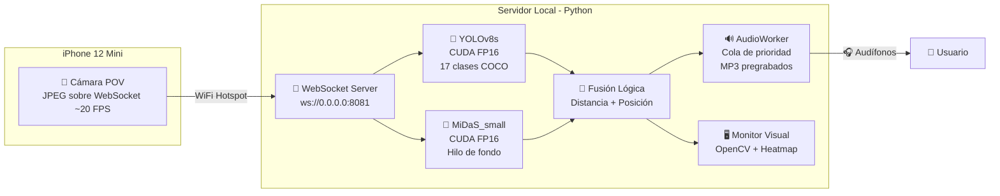

<p align="center">
  <h1 align="center">👁️ IRIS</h1>
  <p align="center">
    Sistema de asistencia visual en tiempo real para personas con discapacidad visual.
  </p>
  <p align="center">
    
    
    
    
    
  </p>
</p>

---

Convierte un iPhone montado en el pecho (POV) en un dispositivo de navegación para personas con discapacidad visual. El teléfono transmite video por WebSocket a un servidor local que ejecuta **YOLOv8s + MiDaS** para detección de obstáculos y estimación de profundidad. Las alertas de audio se entregan en tiempo real por los audífonos del usuario usando **360+ MP3 pregrabados con ElevenLabs**, reproducidos localmente con latencia de audio cero.

**Diseñado para espacios interiores**: oficinas, hoteles, aeropuertos, museos — entornos donde la red es controlada. Funciona completamente offline con la laptop como hotspot WiFi.

---

## 📽️ Demo

<!-- Reemplaza este bloque con un GIF o enlace a video del sistema funcionando -->

> **TODO:** Agregar GIF/video del sistema procesando un entorno real.
>
> ```
> 
> ```

---

## ⚙️ Cómo Funciona

### Diagrama de Arquitectura



### Flujo de Procesamiento

1. **Captura.** El iPhone transmite frames JPEG (~20 FPS) sobre WebSocket al servidor Python que corre en una laptop.
2. **Detección de objetos.** `YOLOv8s` (CUDA FP16) detecta 17+ clases de obstáculos del dataset COCO: persona, silla, mesa, bicicleta, coche, mochila, maleta, entre otros.
3. **Estimación de profundidad.** `MiDaS_small` (CUDA FP16) corre en un hilo de fondo asíncrono (`MidasWorker`) con una cola `maxsize=1` — el loop principal nunca bloquea en inferencia de profundidad. Genera un mapa de profundidad de 8 bits con suavizado temporal EMA (α=0.6) y Gaussian Blur (5×5).
4. **Detección de peligros de suelo.** Sobre el ROI inferior (30% del frame), MiDaS detecta escaleras/desniveles vía análisis de `std_dev` + heurística de caída relativa. La detección de pared suprime falsos positivos en la unión pared-suelo.
5. **Fusión espacial.** Para cada detección de YOLO, se extrae la profundidad mediana del mapa de MiDaS sobre el bounding box, se estima la distancia en metros, y se clasifica la posición horizontal en tercios (izquierda / frente / derecha).
6. **Audio.** `AudioWorker` reproduce el MP3 pregrabado correspondiente a la combinación `{clase}_{posición}_{distancia}`. Un `GestorCooldown` (4s normal, 2s crítico) previene spam. Las alertas críticas interrumpen y vacían la cola actual.
7. **Monitor visual.** Ventana OpenCV con bounding boxes coloreados por severidad, mapa de calor de profundidad (JET), overlay de FPS y etiqueta de fuente activa.

---

## 🛠️ Instalación

### Prerrequisitos

- Python 3.10+
- NVIDIA GPU con soporte CUDA (probado con RTX 3050)
- [CUDA Toolkit](https://developer.nvidia.com/cuda-downloads) y [cuDNN](https://developer.nvidia.com/cudnn) instalados
- iPhone con una app que transmita JPEG sobre WebSocket (ej. [Camo](https://reincubate.com/camo/) o un cliente WebSocket personalizado)

### 1. Clonar el repositorio

```bash
git clone https://github.com/tu-usuario/visionaid.git
cd visionaid
```

### 2. Crear entorno virtual e instalar dependencias

```bash
python -m venv .venv
.venv\Scripts\activate         # Windows
# source .venv/bin/activate    # Linux/macOS

pip install torch torchvision torchaudio --index-url https://download.pytorch.org/whl/cu121
pip install ultralytics opencv-python websockets pygame elevenlabs python-dotenv
```

> **Nota:** El comando de PyTorch asume CUDA 12.1. Consulta [pytorch.org/get-started](https://pytorch.org/get-started/locally/) para tu versión específica de CUDA.

### 3. Configurar la API key de ElevenLabs

Crea un archivo `.env` en la raíz del proyecto:

```env
ELEVENLABS_API_KEY=tu_clave_api_de_elevenlabs
ELEVENLABS_VOICE_ID=CaJslL1xziwefCeTNzHv
```

La API key solo es necesaria para **generar** los audios. Una vez generados, el sistema funciona completamente offline.

### 4. Generar los archivos de audio

```bash
python generador_audios.py
```

Esto genera los 360+ archivos MP3 en el directorio `audios/`. Ver la sección [Generación de Audio](#-generación-de-audio) para más detalles.

### 5. Verificar que CUDA está disponible

```python
python -c "import torch; print(f'CUDA: {torch.cuda.is_available()}, Device: {torch.cuda.get_device_name(0)}')"
```

---

## 🚀 Uso

### Modos de fuente de video (`--fuente`)

El sistema acepta cuatro fuentes de video vía la flag `--fuente`:

```bash
# 1. WebSocket (modo principal — iPhone montado en el pecho)
python main_vision.py --fuente websocket

# 2. Webcam local (dispositivo 0)
python main_vision.py --fuente webcam

# 3. Cámara IP (apps como IP Webcam para Android)
python main_vision.py --fuente camara_ip --ip 192.168.1.50

# 4. Archivo de video local (por defecto: videoplayback2.mp4)
python main_vision.py --fuente archivo
```

### Configuración del hotspot WiFi

Para el modo `websocket` (el modo de producción):

1. **Configura la laptop como hotspot WiFi.** En Windows: `Configuración → Red e Internet → Zona con cobertura inalámbrica móvil`.
2. **Conecta el iPhone al hotspot.**
3. **Apunta el cliente WebSocket del iPhone** a `ws://<IP_DE_LA_LAPTOP>:8081`.
4. Ejecuta `python main_vision.py --fuente websocket`.
5. El servidor imprimirá la IP y el puerto al arrancar.

> La conexión es punto-a-punto vía hotspot. No se requiere internet. Toda la inferencia es local.

### Controles en tiempo real

| Tecla | Acción |
|:-----:|--------|
| `Q`   | Cerrar el sistema |
| `D`   | Describir el entorno actual (imprime en consola el conteo de objetos por zona) |

---

## 🎙️ Generación de Audio

### Ejecución

```bash
python generador_audios.py
```

El script es **idempotente**: omite los archivos que ya existen en `audios/`, por lo que puede re-ejecutarse si se interrumpe a mitad del proceso.

### Convención de nomenclatura

Cada archivo MP3 sigue el patrón:

```
{clase}_{posición}_{distancia}.mp3
```

| Componente  | Valores posibles | Ejemplo |
|-------------|-----------------|---------|
| `clase`     | `persona`, `silla`, `mesa`, `automovil`, `mochila`, `maleta`, etc. (20 clases) | `persona` |
| `posición`  | `izquierda`, `frente`, `derecha` | `frente` |
| `distancia` | `0_5`, `1_0`, `1_5`, `2_0`, `2_5`, `3_0` (metros, punto reemplazado por `_`) | `1_5` |

**Ejemplo completo:** `persona_frente_1_5.mp3` → *"Atención, persona al frente a 1.5 metros"*

### Categorías de audio

| Tipo | Archivos | Fuente |
|------|----------|--------|
| Alertas de obstáculos | Matriz `20 clases × 3 posiciones × 6 distancias = 360` | `CLASES × POSICIONES × DISTANCIAS_METROS` |
| Alertas especiales | `escalon_frente.mp3`, `pared_frente.mp3`, `pared_izquierda.mp3`, `pared_derecha.mp3` | `generar_audios_especiales()` |
| Monitor de salud | `oscuro.mp3`, `camara_sucia.mp3`, `procesando_lento.mp3` | `generar_audios_especiales()` |
| Monitor de movimiento | `rapido.mp3`, `giro_izquierda.mp3`, `giro_derecha.mp3`, `frenada.mp3`, `retroceso.mp3` | `generar_audios_especiales()` |

### Configuración de voz

| Parámetro | Valor |
|-----------|-------|
| Voz | Cristina Campos (`CaJslL1xziwefCeTNzHv`) |
| Modelo | `eleven_multilingual_v2` |
| Formato | MP3, 44100 Hz, 128 kbps |
| Estabilidad | 0.55 (alertas) / 0.60 (especiales) |
| Similitud | 0.80 |

---

## 🧮 Diseño Técnico

### Estimación de distancia

La distancia de un objeto al usuario se estima combinando el bounding box de YOLO con el mapa de profundidad de MiDaS:

1. Se extrae la **profundidad mediana** del mapa de MiDaS sobre la región del bounding box detectado por YOLO (función `extraer_profundidad_roi`).
2. Se aplica una fórmula de relación inversamente proporcional:

$$
d = \frac{K}{p + \epsilon}
$$

Donde:
- $d$ = distancia estimada en metros
- $K$ = `CONSTANTE_FOCAL` (constante de calibración, por defecto `350.0`)
- $p$ = profundidad mediana del ROI en el mapa MiDaS normalizado (0–255)
- $\epsilon$ = `1e-6` (protección contra división por cero)

La constante $K$ se calibra empíricamente: se coloca un objeto a exactamente 1.0 metro de la cámara, se lee la profundidad mediana $p$ que reporta MiDaS, y ese valor se asigna como `CONSTANTE_FOCAL`. A 2.0 metros, debería reportar ~2.0 m.

### Detección de escaleras y desniveles

Opera sobre el **ROI inferior** (30% más bajo del frame, filas $0.7h$ a $h$):

1. **Desviación estándar del ROI:**

$$
\sigma_{\text{roi}} = \text{std}(\text{depth\_map}[0.7h : h, :])
$$

Si $\sigma_{\text{roi}} > 60.0$, se detecta una discontinuidad significativa en el suelo (escalón, rampa abrupta o precipicio).

2. **Caída relativa:**

$$
\text{caída} = \bar{p}_{\text{superior}} - \bar{p}_{\text{inferior}} > 20.0
$$

Donde $\bar{p}_{\text{superior}}$ es la media de profundidad en las filas $0.7h$ a $0.8h$, y $\bar{p}_{\text{inferior}}$ es la media en las filas $0.95h$ a $h$. Una caída relativa positiva indica que el suelo "se aleja" (desnivel o vacío).

Se emite alerta si **cualquiera** de las dos condiciones se cumple.

### Detección y supresión de pared

Evaluada **antes** que la detección de escaleras para poder suprimir falsos positivos:

1. **Banda de análisis:** filas 25%–75% del frame (evita suelo y techo).
2. **División en tercios horizontales** (izquierda, frente, derecha).
3. Para cada tercio, se calcula $\bar{p}$ (media) y $\sigma$ (desviación estándar):

$$
\text{pared detectada} \iff \bar{p} > 145.0 \;\land\; \sigma < 25.0
$$

Una **media alta** con **baja variación** indica una superficie plana y cercana (pared). El umbral de $\sigma < 25.0$ permite paredes con textura real (ladrillo, yeso rugoso).

4. **Supresión de falso positivo:** Si se detecta pared `"frente"`, se suprime la alerta de escalón. Esto se debe a que la unión pared-suelo cae en la zona compartida (filas 70%–75%) y genera el mismo gradiente brusco que un escalón real.

### Suavizado temporal (EMA)

Los mapas de profundidad se estabilizan entre frames con un filtro de media móvil exponencial:

$$
D_t = \alpha \cdot D_{\text{actual}} + (1 - \alpha) \cdot D_{t-1} \quad (\alpha = 0.6)
$$

Esto elimina el jitter causado por la renormalización min-max frame a frame, sin sacrificar capacidad de reacción.

---

## 📁 Estructura del Proyecto

```
visionaid/
├── main_vision.py          # Punto de entrada. Args CLI, servidor WebSocket, loop de procesamiento
├── modelo_yolo.py          # YoloDetector: wraps YOLOv8s, mapeo COCO→español, helper de género/plural
├── modelo_midas.py         # MidasDepthEstimator: profundidad, escaleras, paredes, EMA temporal
├── fusion_logica.py        # AudioWorker, GestorCooldown, monitores, math de distancia/posición
├── generador_audios.py     # Generador batch TTS con ElevenLabs (standalone, idempotente)
├── server/
│   └── servidor.py         # Servidor WebSocket alternativo (FastAPI, experimental)
├── audios/                 # 360+ MP3 pregrabados (generados por generador_audios.py)
├── .env                    # ELEVENLABS_API_KEY y ELEVENLABS_VOICE_ID (no versionado)
└── .gitignore
```

---

## 🗺️ Roadmap

- [ ] **Pruebas con usuarios reales.** Validar la usabilidad y la latencia percibida con personas con discapacidad visual en entornos controlados.
- [ ] **Precarga de mapa interior.** Cargar un mapa predefinido del espacio (planta de oficina, hotel) para complementar la detección en tiempo real con contexto topológico.
- [ ] **App companion iOS nativa.** Reemplazar la dependencia de apps genéricas de cámara por una app dedicada que optimice el encoding JPEG, WS framing y la rotación de frame.
- [ ] **Modelo YOLO fine-tuned.** Entrenar un modelo específico para obstáculos de interior (puertas entreabiertas, escaleras, columnas, señalización) en lugar de depender del vocabulario genérico de COCO.
- [ ] **Migración a ONNX Runtime.** Exportar ambos modelos a ONNX para reducir dependencia de PyTorch en runtime y potencialmente correr en hardware sin NVIDIA (Intel NPU, Apple Neural Engine).

---

## 🧰 Construido Con

| Componente | Tecnología |
|-----------|-----------|
| Detección de objetos | [YOLOv8s](https://docs.ultralytics.com/) (Ultralytics) |
| Estimación de profundidad | [MiDaS_small](https://github.com/isl-org/MiDaS) (Intel ISL) |
| Inferencia GPU | [PyTorch](https://pytorch.org/) + CUDA FP16 |
| Comunicación iPhone → servidor | [websockets](https://websockets.readthedocs.io/) (JPEG sobre WebSocket) |
| Audio TTS | [ElevenLabs](https://elevenlabs.io/) (voz Cristina Campos, `eleven_multilingual_v2`) |
| Reproducción de audio | [pygame](https://www.pygame.org/) (mixer) |
| Visión por computadora | [OpenCV](https://opencv.org/) |
| Flujo óptico | Lucas-Kanade (OpenCV) |
| Servidor alternativo | [FastAPI](https://fastapi.tiangolo.com/) |

### Hardware probado

| Componente | Especificación |
|-----------|---------------|
| CPU | Intel Core i5 13th Gen |
| RAM | 16 GB |
| GPU | NVIDIA RTX 3050 (CUDA) |
| Cámara | iPhone 12 Mini (montaje POV en pecho) |

---

## 👥 Equipo

<!-- Agrega los miembros del equipo aquí -->

| Nombre | Rol | Contacto |
|--------|-----|----------|
| TBD | Desarrollo principal | — |

---

## 📄 Licencia

Este proyecto está licenciado bajo la [Licencia MIT](LICENSE).
